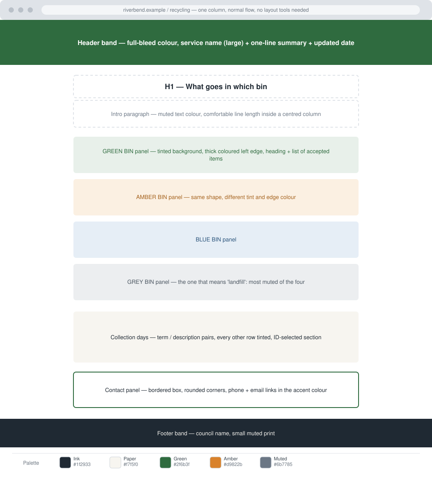

# Riverbend Recycling Guide

Difficulty: Medium

Estimated Time: 60–75 Minutes

---

# What You Will Practice

In this challenge, you will practice:

- Adding CSS to a page
  - An external stylesheet linked from the document head
  - A relative path from the page to the stylesheet
  - CSS comments used to signpost sections of a stylesheet

- Syntax and selectors
  - Rule sets: selector, declaration block, property, value
  - Element selectors
  - Class selectors
  - ID selectors
  - The universal selector
  - Grouping selectors with a comma
  - An element carrying more than one class

- Colour
  - Named colours
  - Hexadecimal, including three-digit shorthand
  - `rgb()` and `rgba()`
  - `hsl()`
  - `color`
  - `opacity`
  - `background-color`

- Borders
  - `border` shorthand
  - Individual sides, such as a thick coloured edge on one side only
  - `border-radius`

- Supporting properties
  - Basic spacing with `margin` and `padding`
  - Basic typography: `font-family`, `font-size`, `font-weight`, `line-height`,
    `text-align`, `text-transform`, `letter-spacing`, `list-style`

- Accessibility
  - Colour contrast that survives a real reading test
  - Never using colour as the only signal
  - Keeping the heading structure the HTML gives you

---

# Challenge

Riverbend District Council sends every household a printed recycling leaflet
once a year. Nobody keeps it, so the contact centre answers the same question
four hundred times a week: *which bin does this go in?*

The council has written the page. It is correct, semantic, unstyled HTML — and
it is a wall of grey text nobody can scan. Your job is to give it a visual
system: a colour for each bin, panels that separate one bin from the next, and
typography that lets somebody find their answer in ten seconds while holding a
yoghurt pot.

This is your first stylesheet in the module, so the layout stays as the browser
lays it out: one column, in document order. Everything you change here is
colour, type, borders and simple spacing.

---

# Design Reference

**Palette**

| Role | Colour |
| ---- | ------ |
| Ink (body text) | `#1f2933` |
| Paper (page background) | `#f7f5f0` |
| Green (brand, green bin) | `#2f6b3f` |
| Amber (garden waste) | `#d9822b` |
| Muted (secondary text) | `#6b7785` |

The blue and grey bin panels need two more colours. Choose them yourself, and
make sure each of the four panels is still legible if the reader cannot tell
your greens from your ambers.

**Type**

Three sizes and two weights are enough: a large page title, a medium panel
heading, and body text at a comfortable reading size. Body lines should be
noticeably taller than the text itself.

---

# Requirements

## Structure and page shell

- Link one external stylesheet. No `<style>` element, no `style` attribute.
- The page background must differ from the colour of the panels sitting on it,
  so the panels read as separate surfaces.
- Body text sits in a centred column that never becomes uncomfortably wide on a
  large screen.

## Header band

- Runs the full width of the window.
- Uses the brand colour behind light text.
- The service name is the largest text on the page; the summary line under it is
  visibly quieter than the name.
- The "last updated" line is smaller and quieter still.

## Bin panels

There are four: green, amber, blue and grey.

- Each panel has its own tinted background and a thick edge on one side in that
  bin's colour.
- Panels share one shape: same corner rounding, same inner padding, same
  vertical gap between them.
- Each panel's heading carries its bin's colour; the body text inside stays
  readable, which usually means it is *not* the bin colour.
- Style them so that adding a fifth bin later means adding one class, not
  writing a new panel from scratch.

## Collection days

- This section is addressed by its `id`, not by a class.
- Alternate rows carry a faint tint so the eye can track across a row.
- Terms read as headings; descriptions read as body text.

## What happens to it

- A numbered sequence, with the numbers kept visible.
- The step text should not sit hard against the numbers.

## Contact panel

- A bordered box in the brand colour, with rounded corners.
- Telephone and email links are visibly links, in a colour that passes contrast
  against the panel behind them.

## Footer band

- Full width, dark, with small quiet text.

---

# Content Requirements

The HTML is provided in the reference page and describes a real service: four
bins, collection days, what happens to the material, and how to contact the
council. Keep the content as it is — this challenge is about the stylesheet.

If you are writing your own HTML from scratch, use realistic content of the same
kind. Do not use Lorem ipsum.

---

# Constraints

- **HTML + pure CSS only.** No JavaScript, no CSS framework, no preprocessor.
- One external stylesheet, linked with a relative path.
- No `<style>` element and no `style` attribute anywhere.
- Do not use any layout system yet: no `display`, no `float`, no `position`, no
  Flexbox, no Grid. The page is one column, in normal flow.
- No media queries, pseudo-elements, custom properties, transitions or
  animations. They arrive later in the module.
- No `box-shadow` and no gradients — this module builds depth from colour and
  borders.
- Every path must be relative, so the page works from disk and from a GitHub
  Pages subdirectory.

---

# Accessibility Requirements

- Body text against its background must reach at least 4.5:1 contrast, and large
  headings at least 3:1. Check the four bin panels in particular.
- Each bin panel is identified by its heading text as well as by its colour. A
  reader who cannot distinguish the colours must still be able to use the page.
- Do not remove underlines from body links unless you give them another visible
  signal.
- Do not change the heading order in the HTML to get a size you want. Style the
  heading you have.
- Do not set a fixed height on any panel; text must be free to grow.

---

# Bonus Challenges

1. Add a fifth "textiles" bin using only your existing panel system plus one new
   class.
2. Give the four bin colours a consistent tint by expressing them in `hsl()`
   with the same lightness and saturation and only the hue changing.
3. Add a "not sure?" callout that reuses the panel shape but reads as a
   different kind of thing.
4. Reduce your stylesheet: find two rules that can be grouped into one.

---

# Testing Checklist

- [ ] Removing the `<link>` leaves a plain but still readable page — you have
      not styled anything by editing the HTML.
- [ ] There is no `style` attribute and no `<style>` block in the document.
- [ ] Every panel keeps its shape when you paste in three extra sentences.
- [ ] The page reads correctly with images and colour disabled.
- [ ] Contrast checked on all four panels and on both bands.
- [ ] The stylesheet has comments marking its sections.

---

# Expected Result

Open the provided reference page to see the intended result, and the design
reference above for the layout and palette.

Read the reference stylesheet only after your own version works.
