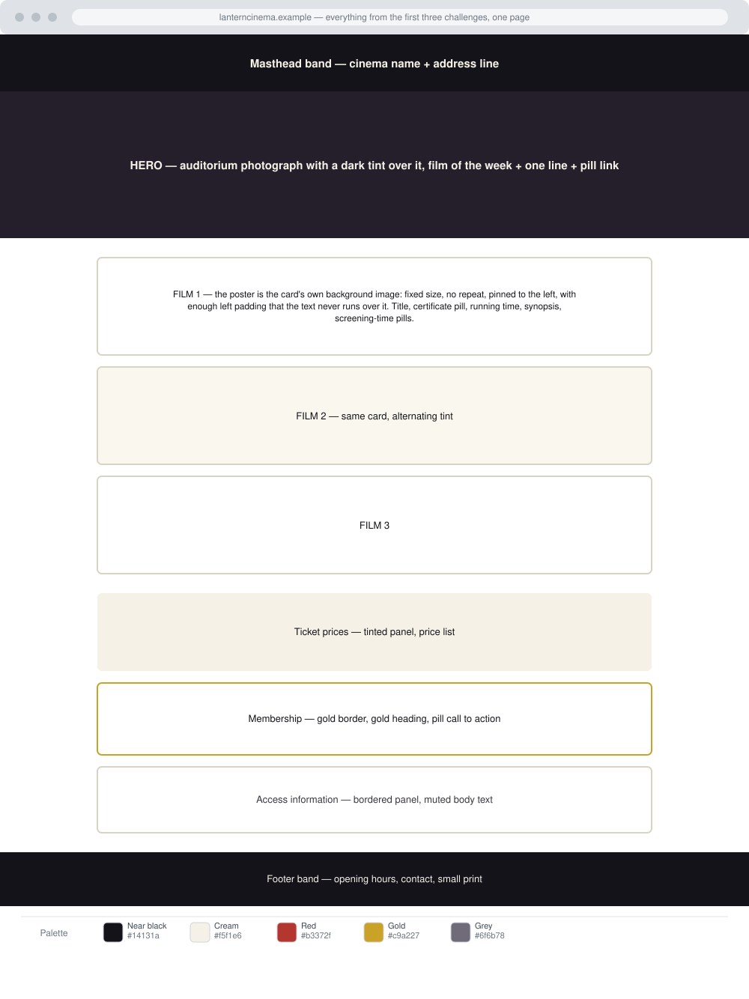

# The Lantern — This Week's Programme

Difficulty: Medium

Estimated Time: 90–105 Minutes

---

# What You Will Practice

This challenge combines everything from the first three. You will practice:

- Backgrounds put to work
  - A photographic hero band
  - An image used as a component's background, sized and positioned so that
    text can be laid out around it
  - Tinted section backgrounds

- The box model, applied consistently
  - `box-sizing`
  - A centred column with a maximum width
  - Padding that reserves space for something else
  - A spacing scale used across a whole page

- Colour and borders
  - A five-colour palette applied to headings, panels, accents and bands
  - `rgba()` for quiet text on dark bands
  - Single-side borders, rounded panels, pill shapes

- Selector discipline
  - Element, class and ID selectors
  - Grouping, multiple classes, and a component with variants
  - Naming that survives a fourth film being added

- Accessibility
  - Contrast over photographs
  - Certificates and times that read correctly without colour
  - Text that reflows when the reader enlarges it

---

# Challenge

The Lantern is a 96-seat independent cinema. Every Monday they publish what is
showing that week. The listing has to do three things at once: sell the film of
the week, let a regular scan the times in five seconds, and answer the questions
the box office is tired of answering.

This is the last challenge before the module moves on to how CSS actually
resolves conflicting rules, so it is deliberately a *whole page* rather than an
exercise: the test is whether your stylesheet stays organised when the page gets
long.

There is still no layout system. The interesting problem in this challenge is
the film card: each one shows its poster beside its text, and you have to
achieve that without any tool that puts two boxes side by side.

---

# Design Reference

**Palette**

| Role | Colour |
| ---- | ------ |
| Near black (bands, headings) | `#14131a` |
| Cream (page background, band text) | `#f5f1e6` |
| Red (accents, certificates) | `#b3372f` |
| Gold (membership, hero accent) | `#c9a227` |
| Grey (secondary text) | `#6f6b78` |

**Supplied images** — in `./assets/images/`

| File | Size | What it is |
| ---- | ---- | ---------- |
| `hero-auditorium.svg` | 1400 × 720 | Hero photograph, pre-darkened |
| `poster-the-quiet-tide.svg` | 300 × 440 | Film poster |
| `poster-north-of-here.svg` | 300 × 440 | Film poster |
| `poster-salt-and-stone.svg` | 300 × 440 | Film poster |

---

# Requirements

## Masthead and hero

- A slim dark masthead band with the cinema name and address line.
- Below it, a photographic hero: the auditorium image covering a band tall
  enough to establish the place, with the film of the week over it.
- The hero photograph scrolls with the page. (The fixed treatment belongs to
  challenge 02; here it would fight the masthead.)

## Film cards

Three films, one card each.

- The poster appears at the left of the card, at a consistent size, not
  repeated, and vertically positioned near the top of the card.
- The card's text sits to the right of the poster and never runs under or over
  it, no matter how long the synopsis is or how narrow the window becomes.
- Every card shares one shape: same padding, same border, same corner rounding,
  same gap between cards.
- Alternate cards have a slightly different background tint, and you should be
  able to add a fourth film without writing a new rule for its tint. (A second
  class on the alternating cards is the tool you have at this stage.)
- Inside each card:
  - The film title is the strongest text.
  - The certificate is a small pill with its own background colour.
  - The running time and director sit in a quieter style.
  - Screening times are pills in a row, wrapping naturally when there is no
    room. They are links.

## Ticket prices

- A tinted panel listing prices, with the price visually distinct from what it
  buys.

## Membership

- A panel that reads as a different kind of thing from the prices: gold border,
  gold heading, and a pill call to action.

## Access information

- A bordered panel with quieter text, covering step-free access, captioned
  screenings, and the audio description service.

## Footer

- Dark band with opening hours, contact details and small print.

---

# Content Requirements

Three real-shaped films with certificates, running times, directors, synopses
and several screening times each; genuine ticket prices; a membership offer; and
real access information. Use the reference content or write your own. No Lorem
ipsum.

---

# Constraints

- **HTML + pure CSS only.** No JavaScript, framework, or preprocessor.
- One external stylesheet, linked with a relative path.
- No `<style>` element and no `style` attribute.
- No layout system: no `display`, `float`, `position`, Flexbox or Grid. The
  poster-beside-text effect must be solved with backgrounds and spacing.
- No media queries, pseudo-classes, pseudo-elements, custom properties,
  transitions or animations yet.
- No `box-shadow` and no gradients.
- The posters are decorative in this design — the film titles carry the same
  information as text. Keep them out of the HTML.
- Relative paths only.

---

# Accessibility Requirements

- Hero text reaches 4.5:1 against the photograph (3:1 for the large title).
- Certificate pills must not rely on colour alone: the certificate is written in
  the pill.
- Screening times are links, and they keep a visible non-colour signal.
- Enlarge the text to 200%: the card text must not slide underneath the poster.
- The access panel is text, not an icon set.
- Keep the heading order the HTML gives you.

---

# Bonus Challenges

1. Add a fourth film and confirm you wrote no new spacing or tint rules.
2. Add a "sold out" state to one screening time, readable without colour.
3. Give the hero a background colour that matches the photograph's darkest area.
4. Add a strip of tiled film-perforation texture along the top edge of the
   footer.
5. Rewrite three of your rules as one grouped rule without changing the page.

---

# Testing Checklist

- [ ] Text never overlaps a poster at any window width down to 320px.
- [ ] Adding two more sentences to a synopsis breaks nothing.
- [ ] All cards share one padding value and one gap value.
- [ ] Screening-time pills wrap onto a second line without changing height.
- [ ] Contrast checked: hero, both dark bands, certificate pills.
- [ ] No horizontal scrollbar at 320px width.
- [ ] Removing the stylesheet leaves a sensible, readable document.

---

# Expected Result

Open the provided reference page to see the intended result.

Read the reference stylesheet only after your own version works.
